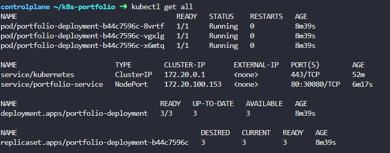
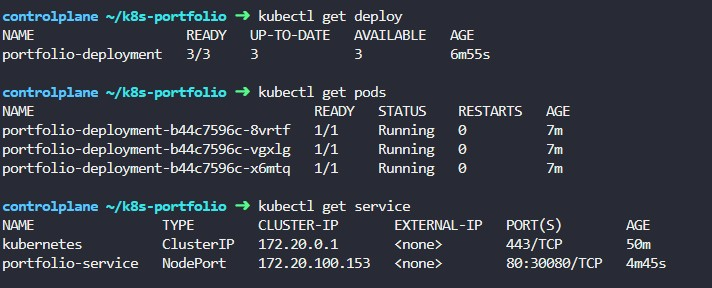
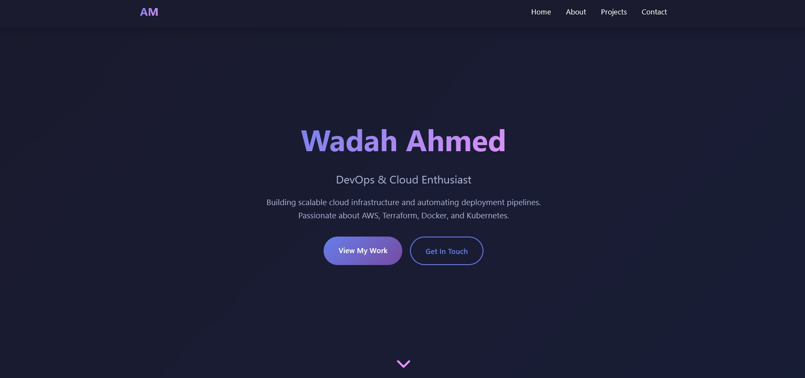
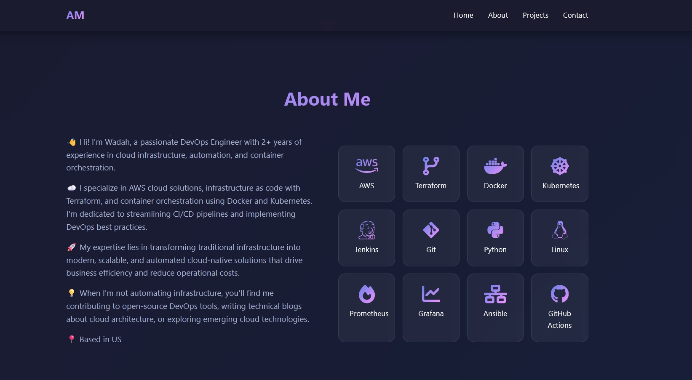
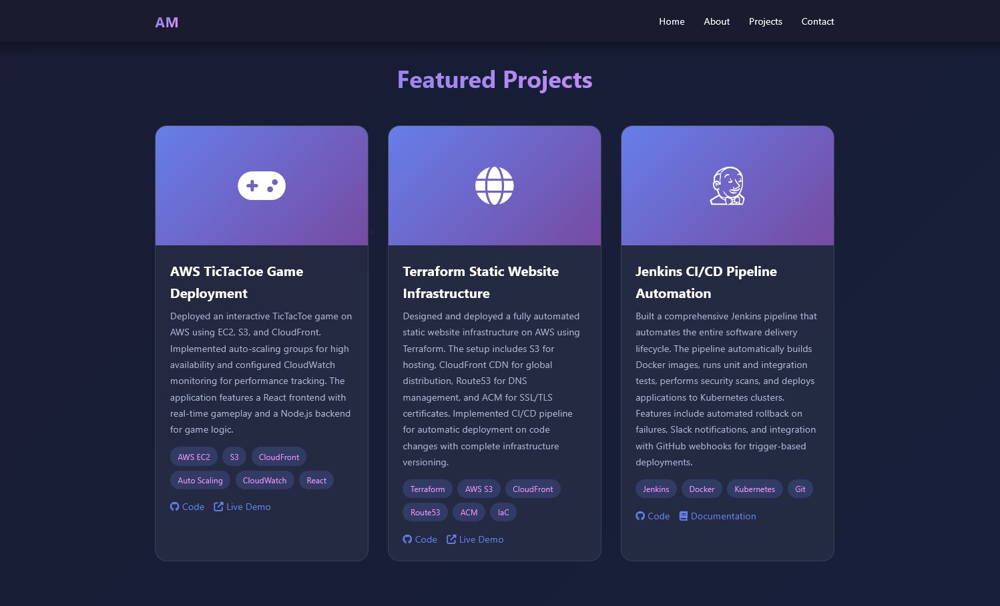
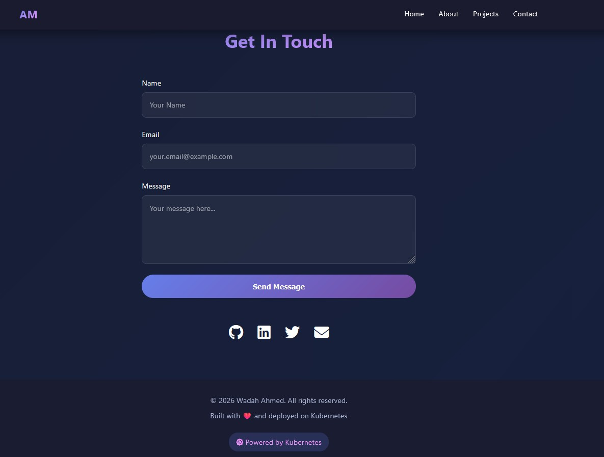

# Deploy Static Website on Kubernetes

## Prerequisites

###    Basic command line knowledge
###    Docker installed (optional, for custom images)
###    kubectl installed
###    A Kubernetes cluster (Minikube, kind, or Docker Desktop)

## Project Structure

```markdown

k8s-portfolio/
├── website/
│   └── index.html
├── Dockerfile
├── deployment.yaml
├── service.yaml
└── ingress.yaml (optional)

```


## Step 1: Set Up Your Local Kubernetes Cluster

## Option A: Using Minikube (Recommended for beginners)

```bash

# Install Minikube (macOS)
brew install minikube

# Install Minikube (Linux)
curl -LO https://storage.googleapis.com/minikube/releases/latest/minikube-linux-amd64
sudo install minikube-linux-amd64 /usr/local/bin/minikube

# Start Minikube
minikube start

# Verify cluster is running
kubectl cluster-info
kubectl get nodes

```

## Option B: Using Docker Desktop
 
###    Open Docker Desktop
###    Go to Settings → Kubernetes
###    Enable Kubernetes
###    Click "Apply & Restart"


## Step 2: Create Your Static Website

### Create a project directory:


```bash

mkdir k8s-portfolio
cd k8s-portfolio
mkdir website

```

### Create a simple HTML file (website/index.html)

## Step 3: Create a Dockerfile


## Step 4: Build and Push Docker Image

### Option A: Using Docker Hub (Free)

```bash

# Build the image
docker build -t your-dockerhub-username/k8s-portfolio:v1 .

# Login to Docker Hub
docker login

# Push to Docker Hub
docker push your-dockerhub-username/k8s-portfolio:v1

```

### Option B: Using Minikube's Docker daemon (No push needed)

```bash

# Point your terminal to Minikube's Docker daemon
eval $(minikube docker-env)

# Build image directly in Minikube
docker build -t k8s-portfolio:v1 .

```

## Step 5: Create Kubernetes Deployment

### Create deployment.yaml

### Apply the deployment:

```bash

kubectl apply -f deployment.yaml

```

### Verify deployment:

```bash

kubectl get deployments
kubectl get pods
kubectl describe deployment portfolio-deployment

```

## Step 6: Create Kubernetes Service

### Create service.yaml

### Apply the service:

```bash

kubectl apply -f service.yaml

```

### Verify service:

```bash

kubectl get services
kubectl describe service portfolio-service

```

## Step 7: Access Your Website

### For Minikube:

```bash

# Get the URL
minikube service portfolio-service --url

# Or open directly in browser
minikube service portfolio-service

```

### For Docker Desktop:

```bash

# Access via localhost
open http://localhost:30080

```

### For Cloud Providers (if using LoadBalancer):

```bash

# Get external IP
kubectl get service portfolio-service

```

## Step 8: Optional - Create Ingress for Domain Access

### Create ingress.yaml

### For Minikube, enable ingress:

```bash

minikube addons enable ingress
kubectl apply -f ingress.yaml

# Add to /etc/hosts
echo "$(minikube ip) portfolio.local" | sudo tee -a /etc/hosts

```

### Access via: http://portfolio.local


## Step 9: Useful Management Commands

```bash

# View all resources
kubectl get all

# Check pod logs
kubectl logs -l app=portfolio

# Scale deployment
kubectl scale deployment portfolio-deployment --replicas=5

# Update image (rolling update)
kubectl set image deployment/portfolio-deployment portfolio=k8s-portfolio:v2

# Delete resources
kubectl delete -f deployment.yaml
kubectl delete -f service.yaml

# Port forward (alternative access method)
kubectl port-forward service/portfolio-service 8080:80
# Access via http://localhost:8080

```

## Step 10: Clean Up

```bash

# Delete all resources
kubectl delete deployment portfolio-deployment
kubectl delete service portfolio-service
kubectl delete ingress portfolio-ingress  # if created

# Or delete using files
kubectl delete -f deployment.yaml -f service.yaml

# Stop Minikube
minikube stop

# Delete Minikube cluster
minikube delete

```

## Troubleshooting Tips

### Pods not starting:

```bash

kubectl describe pod <pod-name>
kubectl logs <pod-name>

```

### Image pull errors:


####    Ensure image name is correct
####    Check imagePullPolicy
####    Verify Docker Hub credentials


### Service not accessible:

```bash

kubectl get endpoints portfolio-service
minikube service list

```

### General debugging:

```bash

kubectl get events --sort-by=.metadata.creationTimestamp

```











